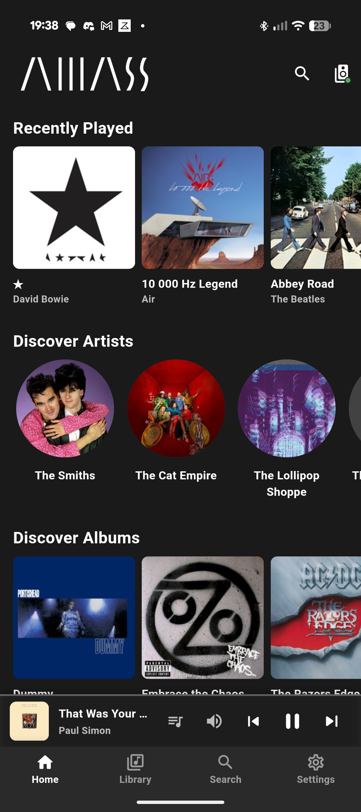
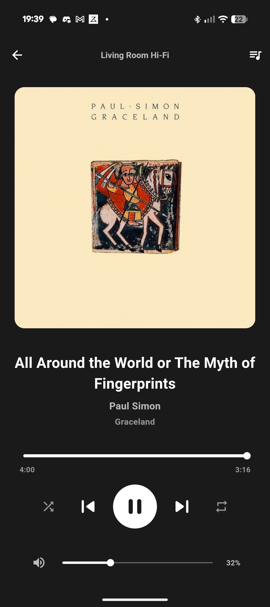
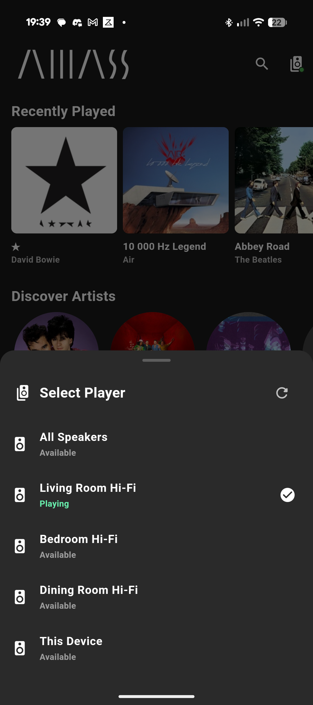

<div align="center">
  
  <h1>Amass Your Music</h1>
  <p>A minimalistic mobile client for <a href="https://music-assistant.io/">Music Assistant</a></p>
  <p>Control your Music Assistant server and manage your entire music library from your mobile device.</p>
</div>

---

## Features

### Music Assistant Integration
- **Server Connection** - Connect to your Music Assistant server via WebSocket
- **Library Browsing** - Browse artists, albums, and tracks from your server
- **Album Details** - View album information and track listings
- **Playback Control** - Control playback on your Music Assistant server players
- **Auto-Reconnect** - Automatic reconnection with connection status monitoring
- **Settings Management** - Configure server URL with persistent storage

### Control Features
- Clean, minimalistic dark UI design
- Full playback controls (play/pause/skip/seek) for server players
- Progress bar with time display
- Volume control for server players
- Now playing display with track information
- Queue management and viewing
- Multi-player support

## Screenshots

<div align="center">
  
  
  
</div>

## Download

Download the latest release from the [Releases page](https://github.com/CollotsSpot/Amass/releases).

## Setup

1. Launch the app
2. Navigate to the **Library** tab
3. Tap **Configure Server** or go to **Settings**
4. Enter your Music Assistant server URL (e.g., `music.serverscloud.org` or `192.168.1.100`)
5. Tap **Connect**
6. Browse your library and control playback on your Music Assistant players!

## Requirements

- Music Assistant server (v2.7.0 or later recommended)
- Network connectivity to your Music Assistant server
- Android device (Android 5.0+)

## About Music Assistant

Amass Your Music is a remote control client for [Music Assistant](https://music-assistant.io/), an open-source music library manager and player that integrates with various music sources and streaming providers. You'll need a running Music Assistant server to use this app. Music playback happens on your Music Assistant server's configured players (speakers, smart devices, etc.), not on your mobile device.

Learn more: [music-assistant.io](https://music-assistant.io/)

## License

MIT License

---

## For Developers

<details>
<summary>Build from Source</summary>

### Prerequisites
- Flutter SDK (>=3.0.0)
- Dart SDK

### Build Instructions

1. Clone the repository
```bash
git clone https://github.com/CollotsSpot/Amass.git
cd Amass
```

2. Install dependencies
```bash
flutter pub get
```

3. Generate launcher icons
```bash
flutter pub run flutter_launcher_icons
```

4. Build APK
```bash
flutter build apk --release
```

The APK will be available at `build/app/outputs/flutter-apk/app-release.apk`

</details>

<details>
<summary>Technologies Used</summary>

- **Flutter** - Cross-platform mobile framework
- **web_socket_channel** - WebSocket communication with Music Assistant server
- **provider** - State management
- **shared_preferences** - Local settings storage
- **http** - HTTP requests for API communication

</details>
