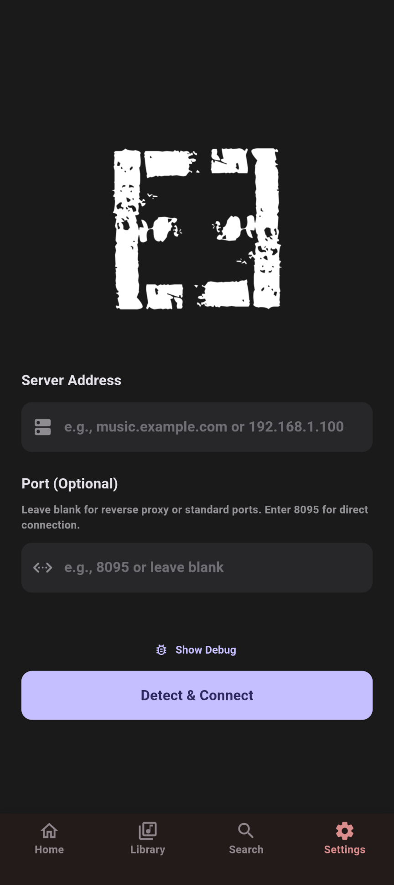
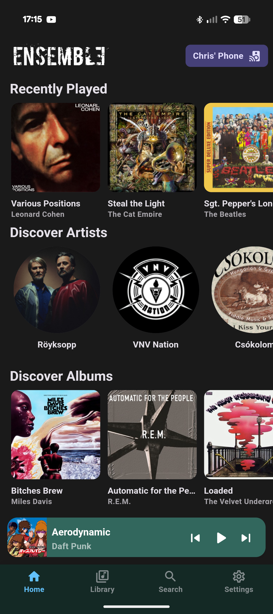
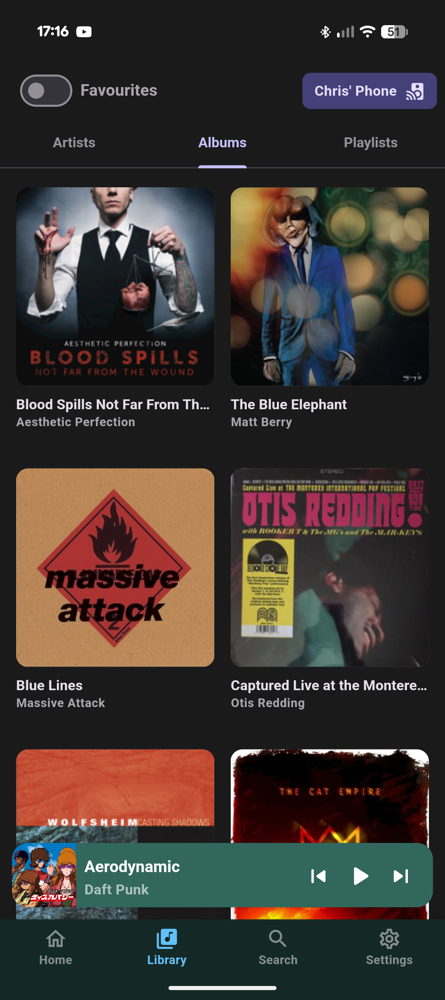
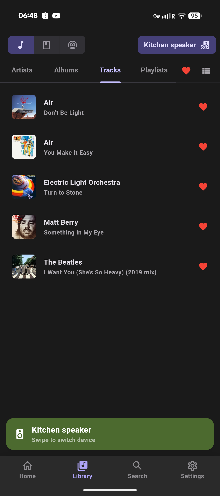
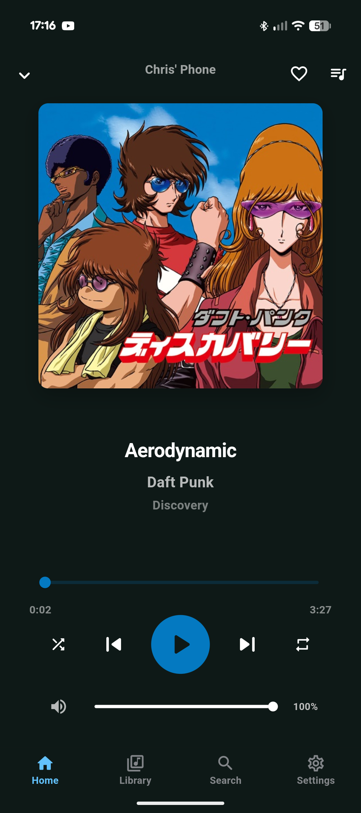
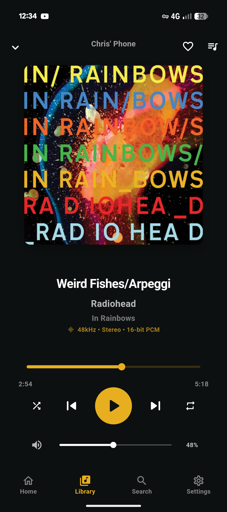

<div align="center">
  

---

  <p>A minimalistic mobile client for <a href="https://music-assistant.io/">Music Assistant</a></p>
  <p>Stream your music library directly to your phone, or control playback on any connected speaker.</p>
</div>

---

## Disclaimer

I am not a developer. This application was created using **Claude Code** and **Gemini CLI**.

---

## Features

### Local Playback
- **Stream to Your Phone** - Play music from your Music Assistant library directly on your mobile device
- **Background Playback** - Music continues playing when the app is minimized
- **Media Notifications** - Control playback from your notification shade with album art display

### Remote Control
- **Multi-Player Support** - Control any speaker or device connected to Music Assistant
- **Device Selector** - Quickly switch between your phone and other players
- **Full Playback Controls** - Play, pause, skip, seek, and adjust volume
- **Queue Management** - View and manage the playback queue

### Library Browsing
- **Browse Your Collection** - Artists, albums, and tracks from all your music sources
- **Album Details** - View track listings with artwork
- **Search** - Find music across your entire library

### Smart Features
- **Auto-Reconnect** - Automatically reconnects when connection is lost
- **Caching** - Fast navigation with cached content
- **Hero Animations** - Smooth transitions between screens

### Theming
- **Material You** - Dynamic theming based on your device's wallpaper
- **Adaptive Colors** - Album artwork-based color schemes
- **Light/Dark Mode** - System-aware or manual theme selection

## Screenshots

<div align="center">
  
  
  
</div>

<div align="center">
  
  
  
</div>

## Download

Download the latest release from the [Releases page](https://github.com/CollotsSpot/Ensemble/releases).

## Setup

1. Launch the app
2. Enter your Music Assistant server URL (e.g., `music.example.com` or `192.168.1.100`)
3. Connect to your server
4. Start playing! Music plays on your phone by default, or tap the device icon to choose a different player.

## Authentication

Ensemble supports multiple authentication methods:

| Method | Status |
|--------|--------|
| Music Assistant native auth | Tested |
| No authentication | Tested |
| Authelia | Implemented, not recently tested |
| HTTP Basic Auth | Implemented, not recently tested |

**Note:** Development and testing is done against Music Assistant beta with native authentication enabled.

## Requirements

- Music Assistant server (v2.7.0 or later recommended)
- Network connectivity to your Music Assistant server
- Android device (Android 5.0+)

> **Note:** Local device playback (streaming to your phone) is not currently supported on Music Assistant beta 20+. This is due to MA replacing the built-in player with Sendspin. Support will be added once Sendspin is more stable. Remote control of other players works fine.

## About Music Assistant

Ensemble is a mobile client for [Music Assistant](https://music-assistant.io/), an open-source music library manager that integrates with various music sources and streaming providers.

With Ensemble, you can:
- **Stream locally** - Use your phone as a Music Assistant player
- **Control remotely** - Manage playback on smart speakers, Chromecast, Sonos, and more

Learn more: [music-assistant.io](https://music-assistant.io/)

## License

MIT License

---

## For Developers

<details>
<summary>Build from Source</summary>

### Prerequisites
- Flutter SDK (>=3.0.0)
- Dart SDK

### Build Instructions

1. Clone the repository
```bash
git clone https://github.com/CollotsSpot/Ensemble.git
cd Ensemble
```

2. Install dependencies
```bash
flutter pub get
```

3. Generate launcher icons
```bash
flutter pub run flutter_launcher_icons
```

4. Build APK
```bash
flutter build apk --release
```

The APK will be available at `build/app/outputs/flutter-apk/app-release.apk`

</details>

<details>
<summary>Technologies Used</summary>

- **Flutter** - Cross-platform mobile framework
- **audio_service** - Background playback and media notifications
- **web_socket_channel** - WebSocket communication with Music Assistant
- **provider** - State management
- **cached_network_image** - Image caching
- **shared_preferences** - Local settings storage

</details>
